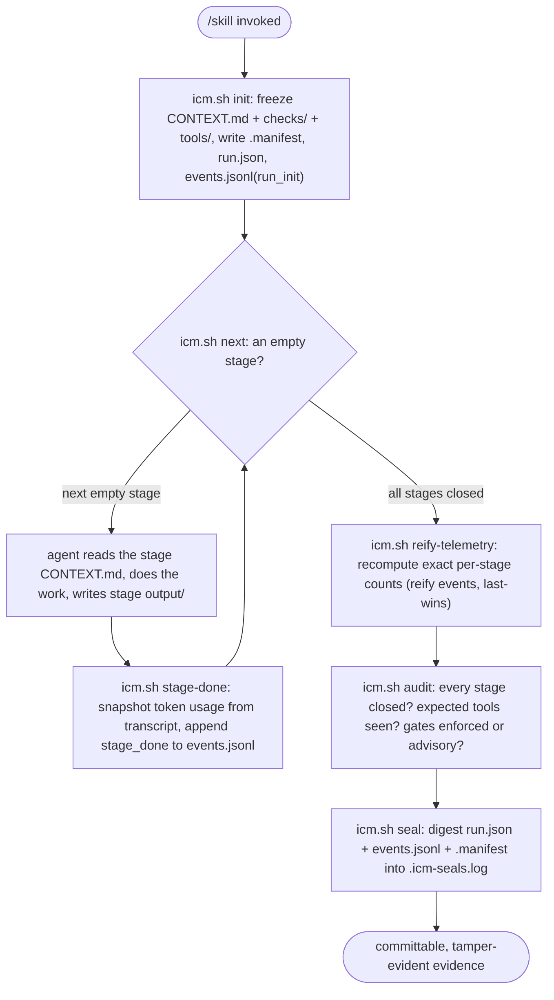
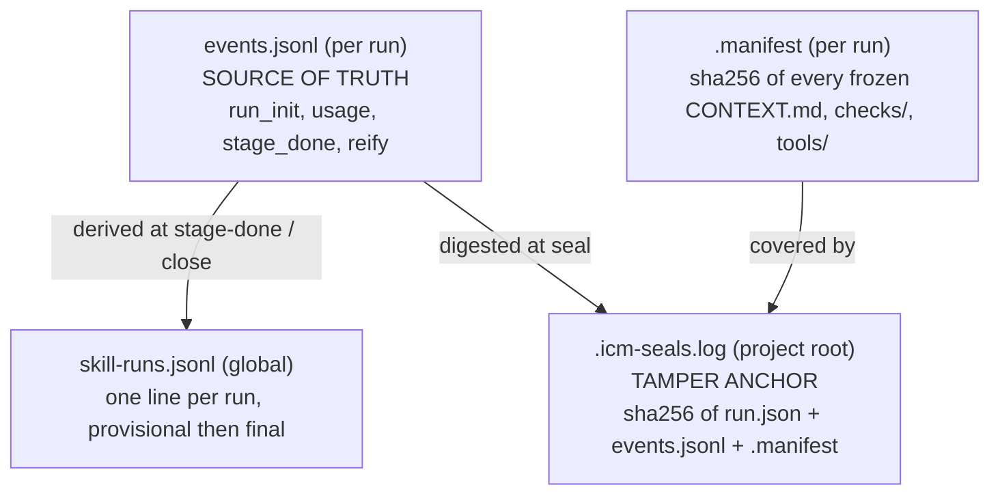
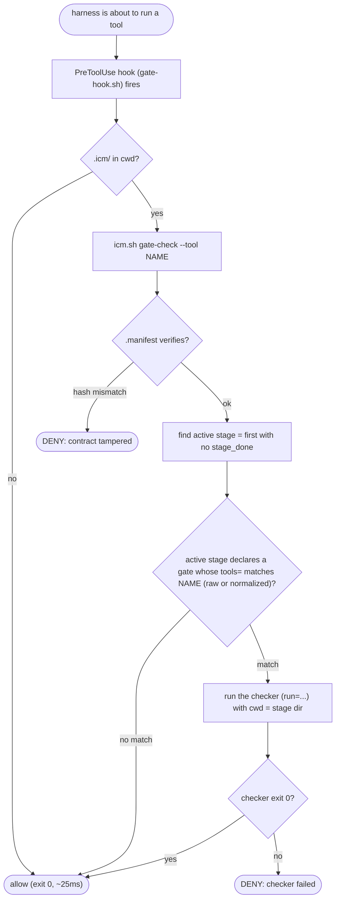
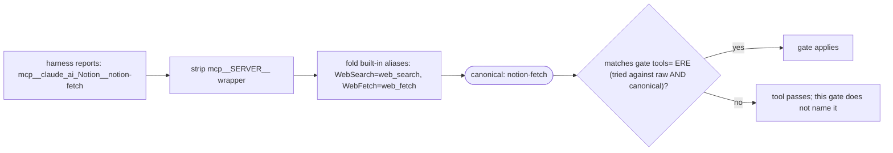
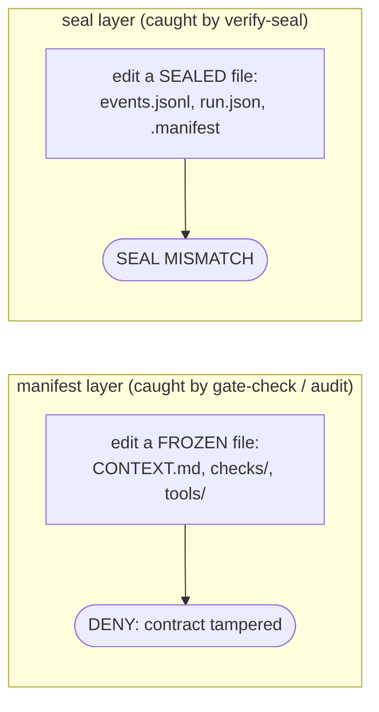

# ICM Runtime — Folder Structure as Agent Architecture

**Interpretable Context Methodology (ICM)** implemented as reusable coding agent skills.

> ICM was created by **Jake Van Clief** ([@RinDig](https://github.com/RinDig))
> and **David McDermott** in their paper
> *"Interpretable Context Methodology: Folder Structure as Agentic Architecture"*
> ([arXiv:2603.16021](https://arxiv.org/abs/2603.16021), March 2026).
>
> This runtime is a coding-agent-native implementation of their methodology.
> The ideas — the five-layer context hierarchy, stage contracts, folder-based
> orchestration — are theirs.
>
> **Original repository:** [RinDig/Interpreted-Context-Methdology](https://github.com/RinDig/Interpreted-Context-Methdology)
>
> This project packages ICM as installable skills for coding agents that support
> the [Agent Skills](https://agentskills.io/) standard (PI, Claude Code, Codex, and others).

## What it does

ICM replaces multi-agent framework orchestration (CrewAI, LangChain, AutoGen) with
filesystem structure. Numbered folders = pipeline stages. Markdown files = prompts
and context. A single agent, reading the right files at the right moment, does the
work that would otherwise require a multi-agent framework.

## Install

```bash
git clone <repo-url> ~/Code/icm-runtime
cd ~/Code/icm-runtime
./installer.sh
```

The installer symlinks skill directories into `~/.agents/skills/` (PI, Codex - namespaced,
discovered recursively) and into `~/.claude/skills/` (Claude Code - flattened, since Claude Code
discovers skills only one level deep). If your coding agent doesn't follow symlinks during skill
discovery, use `--copy` instead:

```bash
./installer.sh --copy
```

Restart your coding agent and the skills are available.

Symlink mode: edits in `~/Code/icm-runtime/` propagate immediately.
Copy mode: re-run `./installer.sh --copy` to pick up changes.

Uninstall: `./installer.sh --remove`

## Included Skills

| Skill | What it does |
|-------|-------------|
| `icm` | The runtime itself (init, stages, gate-check, stage-done, reify, audit, seal). Used by every workspace skill; not invoked directly. |
| `kakkoidev/icm-demo` | Runnable, offline, self-teaching showcase of the runtime AND the canonical authoring template. Run it to watch gates, telemetry, and seals work. Start here. |
| `jake-van-clief/ai-folder-research` | 3-stage pipeline: research a topic, draft analysis, polish into final output. |
| `kakkoidev/draft-report` | 3-stage: frame, draft, tighten a stakeholder report in a fixed house style. |
| `kakkoidev/publish-to-notion` | 3-stage: render to Notion-flavored markdown, publish via MCP, fetch back and verify. |
| `kakkoidev/signoff-proposal` | 3-stage: gather evidence, compose a sign-off proposal, publish and verify in Notion. |

## Commands

```
/ai-folder-research                    # Start new research pipeline
/ai-folder-research run                # Continue latest run
/ai-folder-research run stage 02       # Re-run a specific stage
/ai-folder-research list               # Show run history
/ai-folder-research diff               # Diff last two completed runs
/ai-folder-research clean --keep 3     # Prune old runs
```

## How it works

ICM turns a skill into a sequence of frozen stage contracts and walks the model through them
one stage at a time, recording everything to a single auditable per-run log. The model is the
non-deterministic glue between deterministic checkpoints; the runtime owns all state.

### Running a skill, step by step

1. **Trigger.** The user invokes a skill (e.g. `/ai-folder-research`). The skill's `SKILL.md`
   instructs the agent to drive everything through `icm.sh` and never scaffold directories or
   format timestamps by hand.
2. **`icm.sh init <ns>/<skill>`** creates a timestamped run at `.icm/<ns>/<skill>/<run_id>/`,
   freezes each stage's `CONTEXT.md` (the contract) plus the skill's `checks/` and `tools/`
   directories, and writes a sha256 `.manifest` over all of them. It writes the static run
   header to `telemetry/run.json` and the first event, `run_init`, to `telemetry/events.jsonl`.
3. **The agent executes one stage at a time.** It reads the active stage's `CONTEXT.md`, does the
   work (tool calls, writing files into `.../<stage>/output/`), and one stage's output is the next
   stage's input. A human can edit any intermediate output; the next stage picks up the change.
4. **`icm.sh stage-done --stage <name>`** closes the stage: it snapshots the stage's token usage
   from the live session transcript and appends `usage` events plus a `stage_done` boundary event
   to `events.jsonl`. Closing each stage in real time matters: the boundary defines the window the
   next stage's usage is measured against, and marks the stage "closed" for gate scoping.
5. **Gates enforce the *active* stage** (only with `--hooks` installed). Before every tool call the
   harness asks `icm.sh gate-check`; a stage's gate fires only while that stage is active (entered
   but not yet closed). See [Stage gates](#stage-gates-harness-enforced).
6. **Close out the run.** `icm.sh reify-telemetry` recomputes exact per-stage counts from the full
   transcript and appends `reify` events (last-wins, never rewriting). `icm.sh telemetry` writes the
   run's one-line entry to the global index. `icm.sh seal` anchors the evidence for tamper detection.



Gates run on a parallel track: on every tool call the harness consults `gate-check`
(see [Stage gates](#stage-gates-harness-enforced)) before the call is allowed.

### What tracks the run

| Artifact | Scope | What it holds |
|---|---|---|
| `telemetry/run.json` | per run | static, sealed header: workspace, run_id, created, stages, cwd, caller |
| `telemetry/events.jsonl` | per run | **source of truth**: one ordered append-only stream of `run_init`, `usage`, `stage_done`, `reify` events |
| `.manifest` | per run | sha256 of every frozen `CONTEXT.md`, `checks/` and `tools/` file |
| `.icm/telemetry/tool-calls.jsonl` | per project | every `icm.sh` invocation, and (with `--hooks`) the tool name of every harness tool call |
| `.icm/telemetry/tool-args.jsonl` | per project | (with `--hooks`) the arguments of every harness tool call, for execution-spec verification |
| `.icm/telemetry/transcript-path[.<session_id>]` | per project | the session transcript path used to snapshot token usage |
| `~/.icm/telemetry/skill-runs.jsonl` | global | one **derived** line per run (`provisional` at first stage-done, `final` on close) |
| `.icm-seals.log` | project root (committable) | sha256 seal over `run.json` + `events.jsonl` + `.manifest` |

The layering: **`events.jsonl` is the per-run source of truth**; **`skill-runs.jsonl` is a derived
cross-project index** (one line per run); **`.icm-seals.log` is the tamper anchor**. Everything
`icm.sh stages` / `audit` / `telemetry` reports is read back from `events.jsonl`, with no implicit
joins across separate files. Each `stage_done` / `usage` / `reify` event carries all four token
fields (`tokens_in` = new input only, `cache_creation`, `cache_read`, `tokens_out`), so cost is
computable without losing the cache breakdown.



Read direction matters: `stages` / `audit` / `telemetry` all read back from
`events.jsonl`; nothing joins across files at read time. `skill-runs.jsonl` and
`.icm-seals.log` are written FROM `events.jsonl`, never the other way.

## Observability

### Tool logging
Every `icm.sh` invocation in a project with `.icm/` writes to
`.icm/telemetry/tool-calls.jsonl`. Each line records: timestamp, command, args,
working directory, exit code.

### Per-run telemetry (`events.jsonl`)
Each run's `telemetry/events.jsonl` is the single append-only source of truth (see the table
in [How it works](#how-it-works)). `run_init` is written at `init`; `stage-done` appends one
`usage` event per deduped API call in the stage window plus a `stage_done` boundary; reify
appends `reify` events (last reify wins over the original `stage_done`, so a seal taken earlier
stays valid). `run.json` stays the static, sealed header.

**Closing each stage in real time is MANDATORY.** `icm.sh stage-done --stage <name>` snapshots
the stage's usage from the live session transcript before the harness cleans it up, so counts
survive. The model does NOT pass token counts: they are read from the transcript (new input,
cache creation, cache read, and output kept separate), and the model name is auto-detected.
`stage-done --full` additionally freezes the raw transcript window into the stage dir for
forensics; that IS conversation content, so leave it gitignored. The transcript is resolved
deterministically from the session id under Claude Code, else from the gate-hook record, else
by cwd-filtered newest-session detection (the chosen source is recorded on each event). `icm.sh
reify-telemetry` recomputes exact counts post-hoc; `audit` flags any completed stage with no
`stage_done` event.

Skills that invoke other ICM skills as a sub-step pass `icm.sh init <child>
--caller <parentWs>/<parentRunId>/<stage>`; the child records that `caller` in its sealed
`run.json`, so parent->child links are explicit and tamper-evident rather than inferred from
timing. `icm.sh children <ws> [<run_id>]` lists a run's children. Child runs keep their own run
dir (not nested under the parent), so every command still addresses them.

### Seal
`icm.sh seal <workspace>` appends a sha256 digest line for the latest run's evidence
(`run.json`, `events.jsonl`, and `.manifest`) to `.icm-seals.log` at the project root; commit
that file (it lives outside the gitignored `.icm/`). `icm.sh verify-seal <workspace>` recomputes
and exits 1 on mismatch; `verify-seal --all` checks every sealed run still on disk (pruned runs
are skipped, not failed). Each seal records the exact files it covered, so it verifies against
whatever it sealed. This is tamper evidence, not prevention: it converts a silent telemetry edit
into a visible digest mismatch and git diff, within the same negligent-not-malicious threat
model as gates.

### Audit
`icm.sh audit <workspace>` reads `events.jsonl` and does three checks: (1) every completed stage
has a `stage_done` event; (2) expected tools, declared per stage via `<!-- ICM-TOOLS
expect="..." -->`, are matched against the harness tool calls recorded by the enforcement
adapter, attributed to each stage's time window; (3) if the run declares gates or expected tools
but no gate-check records exist, it surfaces a "gates were advisory only" banner (the
enforcement hook was never installed). Produces a deviation report with a per-stage token-usage
summary; `--strict` exits non-zero on any deviation. Actual tool records exist only where an
adapter is registered; audit says so instead of guessing.

### Deterministic tools
Skills can include a `tools/` directory with shell scripts for gate checkers and
stage processing. Tools are frozen into each run and added to the tamper-evidence
`.manifest`. Expected harness tools are declared with an ICM-TOOLS line in the
stage contract (EREs, unanchored, one line per contract), frozen and manifest-covered
like gates.

## Stage gates (harness-enforced)

Stage contracts are prose, and prose does not bind: an agent can skip a verification step
it knows about. Gates make a stage's verification mechanical. A stage declares one line:

```
<!-- ICM-GATE tools="mcp__claude_ai_Slack__slack_send_message(_draft)?" run="checks/preservation.sh" -->
```

- `tools` is an ERE matched (unanchored) against the tool name the harness reports.
- `run` is a checker command executed with cwd = the run's stage dir. Exit 0 = gate passes.
  If its first token is a file frozen at the run root (e.g. `checks/preservation.sh`), it is
  resolved there. The degenerate form needs no script:
  `run="grep -Eq '^RESULT: PASS$' output/preservation.md"`.

`icm.sh init` freezes the gate with the contract (plus the skill's `checks/` dir) into the
run and writes a sha256 `.manifest`. `icm.sh gate-check --tool <name>` evaluates the latest
run per workspace and exits 1 with `DENY` lines when a matching gate fails. Every manifest
entry is verified first, so editing the frozen contract, deleting the gate line, or touching
a frozen checker all deny as tampered.

**Gates are scoped to the active stage.** A gate fires only while its owning stage is the run's
active stage (entered but not yet closed, i.e. the first stage with no `stage_done` event). A
later stage's gate cannot deny a tool an earlier stage legitimately uses (a common-tool gate
like `tools="Write"` would otherwise deadlock a pure-authoring pipeline), and a completed run
has no active stage, so it denies nothing - one unfinished gated run can't tax unrelated work in
the same `.icm` root. Manifest tamper-evidence is still checked before any scoping.



Enforcement runs in the harness, outside the model's control, with one adapter per agent:

- **Claude Code:** `gate-hook.sh`, a PreToolUse hook consulted on every tool call
  (matcher `.*`), so built-in tools (WebSearch, WebFetch, Bash, ...) are gated and
  logged, not just MCP tools. Outside `.icm` projects it exits in ~25ms; inside,
  a full gate evaluation is ~60-80ms per call. Re-run `installer.sh --hooks` to
  migrate a pre-0.6 `mcp__.*` registration.
- **pi:** `icm-gate.ts`, a `tool_call` extension that blocks while `gate-check` denies.

Register both at once (each is skipped if its harness is absent):

```bash
./installer.sh --hooks    # Claude Code: ~/.claude/settings.json; pi: ~/.pi/agent/extensions/
```

or commit this to a workspace repo's `.claude/settings.json` so enforcement travels with
`git clone`:

```json
{
  "hooks": {
    "PreToolUse": [
      {
        "matcher": ".*",
        "hooks": [
          {
            "type": "command",
            "command": "$HOME/.agents/skills/icm/runtime/gate-hook.sh",
            "timeout": 15
          }
        ]
      }
    ]
  }
}
```

Threat model: this defends against a negligent agent (skips a check, sends before
verifying), not a malicious one. The agent can still delete the run dir or fabricate
checker inputs; workspaces that commit `.icm/` make that loud in git history. Enforcement
exists only where an adapter is registered; agents without one (Codex) see gates as
advisory only. `icm.sh gate-status` makes absence loud: exit 1 when active runs declare
gates but no scope registers enforcement, and (harness-aware) when running inside Claude
Code without a Claude-scope registration, since a pi-only registration is not enforcement
there. Publish-stage contracts should run it before sending.

Cross-harness tool naming: the same tool is named differently per harness (Claude Code
`mcp__claude_ai_Notion__notion-fetch`, `WebSearch`; pi/Codex `notion-fetch`, `search_web`).
The runtime normalizes tool names before matching - it strips the `mcp__<server>__` wrapper
and folds known built-in aliases (`web_search`, `web_fetch`) - so write the canonical core
name once (`notion-fetch`, `web_search`) and the gate or `ICM-TOOLS` line binds in every
harness. Matching tries both the raw and normalized name, so older patterns (raw `mcp__` names
or hand-written alternations like `(search_web|WebSearch)`) keep working.



### Execution specs (`ICM-CALL`)

`ICM-GATE` checks an output condition; `ICM-CALL` checks the *call itself*. A stage can
declare the exact tool and the argument fields a small executor must fill:

```
<!-- ICM-CALL tool="notion-create-pages" args="parent,content" -->
```

With `--hooks` installed, the adapter records each tool call's arguments to
`tool-args.jsonl`. `icm.sh audit` then verifies that within the stage's window the named
tool (its `mcp__<server>__` wrapper stripped for matching) was called with every required
arg field present; a missing call or a missing field is a deviation and fails `--strict`.
This is the verifiable half of "smart model builds the spec, small model fills it": the
executor's freedom shrinks to supplying the named arguments, and the runtime checks it did.

An `args` entry can be a bare field name (the field must be present) or `field@path` (the
field's value must equal the run-root-relative file's content, e.g.
`body@01-render/output/page.md`) - that verifies the executor glued the right prior-stage
output into the call, not just that the field exists.

CI runs `sh tests/gate.test.sh` on ubuntu and macos (`.github/workflows/test.yml`);
run it locally before release too. The suite is hermetic: it sandboxes `$HOME`
under a tmp dir.

## Edge cases and gotchas

Real behaviors that surprise people. Most are by-design; knowing them saves debugging.

### Tamper-evidence: two separate layers
There are two independent tamper detectors, and neither catches the other's edit:



- Editing a `CONTEXT.md` leaves the seal OK (the `.manifest` FILE is unchanged), and
  editing `events.jsonl` leaves the manifest OK. You need both checks.
- It is tamper **evidence, not prevention**. The threat model is a negligent agent, not
  a malicious one: an agent can still delete the run dir or feed a checker fake inputs.
  Commit `.icm/` (or at least `.icm-seals.log`) so edits show up in git history.

### Sealing and audit are POST-RUN
- A stage cannot audit or seal itself: its own `stage-done` is not recorded until after
  its work, so an in-stage audit reports the stage as "MISSING stage-done" and the seal
  omits the last boundary. Seal AFTER the final `stage-done` (the SKILL.md Seal section),
  as every workspace skill does.
- `audit` prints the per-stage **token usage table only when the run is complete** (every
  stage has output) and `jq` is installed. A partially-run audit shows the gate/tool
  checks but not the token block.

### Enforcement requires a registered adapter
- Gates are inert prose without a harness adapter: Claude Code `gate-hook.sh` (PreToolUse),
  pi `icm-gate.ts`. Codex has none, so gates there are advisory.
- WITHOUT `installer.sh --hooks`, a run that declares gates audits with exactly one
  **expected** deviation: "gates were ADVISORY ONLY". That is the runtime reporting your
  setup, not a failure. `icm.sh gate-status` makes the absence loud (and fails in Claude
  Code if only a pi adapter is registered).
- Gates are scoped to the **active stage** only. A gate on a common tool (`tools="Write"`)
  would deadlock the stage that owns it, so gate real ACTION tools (`notion-create-pages`)
  on a PRE-action invariant instead. A completed run has no active stage and denies nothing.

### Telemetry honesty and concurrency
- `stage-done` reads token counts from the session transcript (resolved: session-env >
  hook-recorded path > newest under cwd > newest anywhere; `audit` flags a guessed source).
  The hook-recorded path is a single shared file, correct only without **concurrent
  sessions** in the same project.
- Closing stages in the same second (or batching `stage-done`) yields **zero-width
  windows**: null per-stage counts and unreliable tool attribution. Close each stage in
  real time, in order.
- Sandbox / no-transcript runs record `counts: estimated`, `transcript_source: none` with
  null token fields. Do not read those as real usage.

### Authoring and resolution
- `SKILLS_DIR` is fixed to the install root (derived from `icm.sh`'s own path); it is NOT
  env-overridable. `init` resolves a workspace under it: `namespace/name` is deterministic,
  a bare name is a recursive find.
- Stage outputs are relative to the **stage dir** (`init` creates `<run>/<stage>/output/`).
  Run a stage's commands positioned at the run/stage path, or write to the explicit
  `<run>/<stage>/output/...` path; do not assume the project root is the stage dir.
- `ICM-CALL` verifies one named tool was called with required args; a **branching** stage
  (create vs update) cannot use one spec and falls back to the looser `ICM-TOOLS`
  alternation. Work buried in a `tools/` script is opaque to `audit` (it sees "Bash ran"),
  so cover that surface with `eval/`.

## Building your own workspace

Scaffold one with `icm.sh new-skill <ns>/<name> --stages a,b,c` (it emits a SKILL.md, one
stub per stage, a `tools/` dir, and an eval), then fill in each stage's Process. Or copy an
existing skill such as `skills/jake-van-clief/ai-folder-research/`. Run the installer again to
pick it up; `icm.sh catalog` (and the generated `SKILLS.md`) lists installed skills.

## License

MIT — matching the original ICM project.
