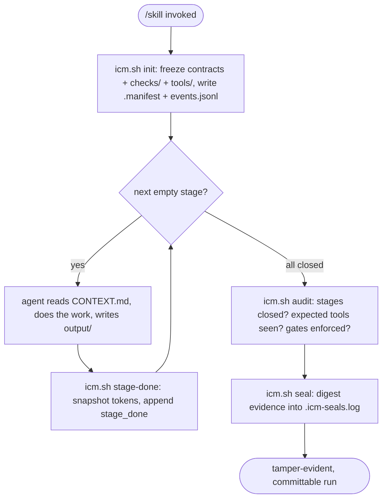

# ICM Runtime - Folder Structure as Agent Architecture

Run AI workflows that are **auditable, token-metered, and tamper-evident** - with no
multi-agent framework. The orchestration lives in folders you can read, not code you can't.

> **Interpretable Context Methodology (ICM)** was created by **Jake Van Clief**
> ([@RinDig](https://github.com/RinDig)) and **David McDermott**
> ([arXiv:2603.16021](https://arxiv.org/abs/2603.16021), March 2026). This repo is a
> coding-agent-native implementation of their methodology; the ideas are theirs.
> Original repo: [RinDig/Interpreted-Context-Methdology](https://github.com/RinDig/Interpreted-Context-Methdology).
> Packaged as installable skills for agents that support the
> [Agent Skills](https://agentskills.io/) standard (Claude Code, pi, Codex).

## What it does

Multi-agent frameworks (CrewAI, LangChain, AutoGen) hide their orchestration inside code,
so you can't easily see what ran, what it cost, or whether the agent followed the spec.

ICM inverts that. A **skill** is a workflow. Its **stages** are numbered markdown files,
frozen into a contract a single agent reads one at a time. Every run records its evidence:
which tools were allowed, how many tokens each stage cost, and a tamper-evident seal. The
runtime owns the state; the model is just the glue between deterministic checkpoints.

## See it in ~2 seconds

The showcase runs fully offline, no model, no network, no credentials:

```bash
bash ~/.agents/skills/kakkoidev/icm-demo/tools/sandbox-tour
```

It builds a throwaway run and shows a gate DENY then ALLOW, a cross-harness tool-name match,
a seal verify then a tamper MISMATCH, and a "contract tampered" deny - the whole value
proposition in one command.

## Install

```bash
git clone https://github.com/KakkoiDev/icm-runtime ~/Code/icm-runtime
cd ~/Code/icm-runtime
./installer.sh           # symlink mode (edits propagate); use --copy for a portable copy
./installer.sh --hooks   # register enforcement (Claude Code hook + pi extension)
```

Restart your agent. Symlink mode: edits in the repo apply immediately. Uninstall:
`./installer.sh --remove`.

## Included skills

| Skill | What it does |
|-------|-------------|
| `icm` | The runtime itself. Used by every skill; not invoked directly. |
| `kakkoidev/icm-demo` | Offline, self-teaching showcase **and** the canonical authoring template. Start here. |
| `jake-van-clief/ai-folder-research` | Research a topic, draft analysis, polish. |
| `kakkoidev/draft-report` | Frame, draft, tighten a stakeholder report in a house style. |
| `kakkoidev/publish-to-notion` | Render, publish via MCP, fetch back and verify. |
| `kakkoidev/signoff-proposal` | Gather evidence, compose a sign-off proposal, publish and verify. |

## Commands

Every skill is driven the same way:

```
/icm-demo                 # start a new run, all stages
/icm-demo run             # continue the latest run
/icm-demo run stage 02    # re-run a specific stage
/icm-demo list            # run history
/icm-demo diff            # diff the last two completed runs
/icm-demo clean           # prune old runs
```

## How it works

`init` freezes the stage contracts; the agent works one stage at a time, closing each with
`stage-done` (which snapshots tokens from the transcript); then `audit` and `seal` produce
committable, tamper-evident evidence.



Gates run on a parallel track: before every tool call the harness consults `gate-check`,
which denies if the active stage's precondition is unmet or a frozen contract was edited.

**Go deeper:**
- [ARCHITECTURE.md](ARCHITECTURE.md) - the five layers, components, and data flow.
- [docs/REFERENCE.md](docs/REFERENCE.md) - full mechanics: gates, telemetry, seals,
  execution specs, and edge cases.
- [CONTRIBUTING.md](CONTRIBUTING.md) - add a skill, run the tests, cut a release.

## Presentation

A short technical talk lives in [docs/presentation/](docs/presentation/): the
[slide deck](docs/presentation/deck.md) and the
[5-minute talk track](docs/presentation/talk-track.md). Both render as slides with
mermaid diagrams right here on GitHub. To present from a standalone file, render
the markdown with your slide tool of choice (e.g. `npx reveal-md`).

## Building your own skill

```bash
icm.sh new-skill <namespace>/<name> --stages frame,draft,tighten
```

Scaffolds a `SKILL.md`, one stub per stage, a `tools/` dir, and an `eval/`. Fill in each
stage's Process. `kakkoidev/icm-demo` is the annotated reference. See
[CONTRIBUTING.md](CONTRIBUTING.md).

## License

MIT - matching the original ICM project.
