<!--
ICM Runtime - technical deck. Plain markdown; slides split on `---`.
Diagrams are pre-rendered SVGs in diagrams/ (source: diagrams/*.mmd).
Rebuild everything (SVGs + this deck's HTML) in one step:  sh build.sh
Renders in any markdown viewer too: GitHub shows the committed SVGs inline.
-->

# ICM Runtime

## A beta experiment in auditable AI agents

Folders as orchestration - so the harness can check the agent, not just trust it.

`github.com/KakkoiDev/icm-runtime` - MIT - beta

---

# The problem

Multi-agent frameworks (CrewAI, LangChain, AutoGen) put the orchestration **in code**.

- The pipeline is Python objects you read or run, not a file you can open.
- Auditing what ran, what it cost, and whether the spec held means reading or
  instrumenting that code. Tracing exists, but it is opt-in.

Not a flaw - a different design point. ICM's bet: pipeline and evidence as
first-class files, by default.

---

# Two things it gives you

**Author** - scaffold a multi-stage agent skill as markdown contracts + small shell scripts (`icm.sh new-skill`). No orchestration code.

**Enforce** - at runtime the engine freezes those contracts, gates tool calls, meters tokens, and seals the evidence.

Skill creator + run enforcer.

---

# The inversion

Put the orchestration in the **filesystem**, where you can see it.

The runtime owns state. The model is glue between deterministic checkpoints.

---

# Five layers



---

# Anatomy of a skill

```
kakkoidev/icm-demo/
  SKILL.md            # metadata + how to drive it
  stages/
    01-lifecycle.md   # frozen into the run as CONTEXT.md
    02-enforcement.md
    03-telemetry-seal.md
  checks/*.sh         # gate checkers (frozen, hashed)
  tools/*.sh          # deterministic stage scripts (frozen, hashed)
  eval/*.test.sh      # unit tests
```

Markdown + bash. No framework to learn.

---

# Lifecycle

The model only lives inside the stage loop. Everything around it is deterministic.

---

# The run loop



---

# Gates: mechanical preconditions

Declared in the stage contract:

```
<!-- ICM-GATE tools="demo_publish" run="checks/ready.sh" -->
```

- `tools=` is a regex matched against the tool name.
- `run=` is a checker; exit 0 = pass. The hook denies on non-zero.
- **Scoped to the active stage only** - fires while its stage is open,
  not before, not after.

Preconditions are enforced, not suggested.

---

# Tamper-evidence: two layers

Each layer is a sha256 checksum that catches edits to the files it covers.

**Manifest** covers the frozen files - the contracts, checkers, scripts. Edit one
mid-run and `gate-check` denies: "contract tampered".

**Seal** covers the recorded evidence - `run.json`, `events.jsonl`, `.manifest` -
in a committable log at the project root. Edit any of it later and `verify-seal`
says MISMATCH.

Tamper-evident, not locked: you can edit, but never quietly.

---

# Token telemetry: four fields

Per stage, read from the session transcript at `stage-done`:

| field | meaning |
|---|---|
| `tokens_in` | new input tokens |
| `cache_creation` | cache write |
| `cache_read` | cache hit |
| `tokens_out` | output |

Read from the transcript, **never hand-passed by the model**.
Reified post-run with exact counts. The model cannot lie about cost.

---

# Cross-harness by normalization

The same gate matches every harness:

```
Claude Code:  mcp__claude_ai_Notion__notion-fetch
pi / Codex:   notion-fetch
```

Runtime strips the `mcp__<server>__` wrapper and folds built-in aliases
(`WebSearch` -> `web_search`). Write `tools="notion-fetch"` once; it matches
both. Enforcement adapters: `gate-hook.sh` (Claude Code), `icm-gate.ts` (pi).

---

# Live demo - a gate, in 4 commands

```
RUN=$(icm.sh init kakkoidev/gate-demo)
icm.sh gate-check --tool publish               # DENY: receipt missing
echo ok > $RUN/01-publish/output/receipt.md
icm.sh gate-check --tool publish               # ALLOW
```

The gate blocks `publish` until `output/receipt.md` exists. Create the file, the call is let through. Files persist - open them. Offline, ~20 seconds.

---

# Demo output (backup if no terminal)

```
$ icm.sh gate-check --tool publish
DENY ... 01-publish: checker failed: checks/receipt.sh   # blocked: no receipt
$ echo ok > $RUN/01-publish/output/receipt.md
$ icm.sh gate-check --tool publish
ALLOW (exit 0)                                           # receipt present: allowed
```

The DENY is the win - the gate refused the action until its precondition held.

---

# What's real, what's open

**Real:** gates fire live in Claude Code; tamper-evidence holds; 119 tests, CI on Linux + macOS; offline, bash-only.

**Open:** pi adapter runtime-untested; a gate firing on a real model tool call mid-workflow (today's is hand-driven) needs MCP; beta - a bet, not a product.

Testers welcome.

---

# Try it, then tell me

A bet: mechanical, tamper-evident checks on agents are worth having. Worth pursuing?

```
git clone github.com/KakkoiDev/icm-runtime && ./installer.sh
```

Full offline self-test - every mechanism, one command:

```
bash ~/.agents/skills/kakkoidev/icm-demo/tools/sandbox-tour
```

ICM method: Van Clief & McDermott, arXiv:2603.16021
