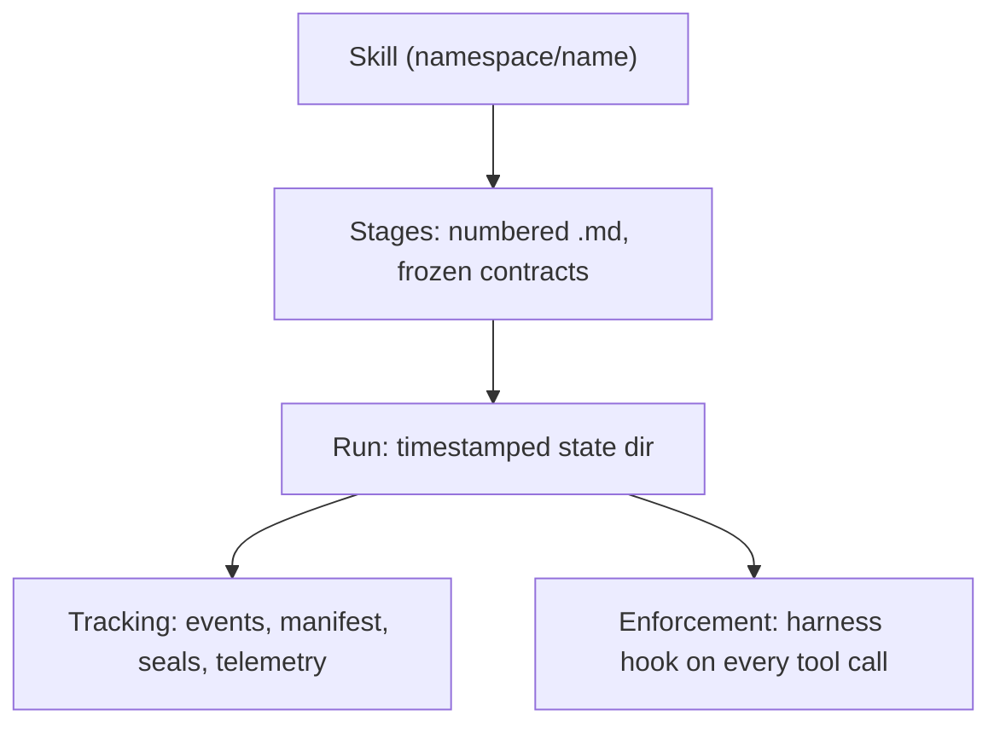
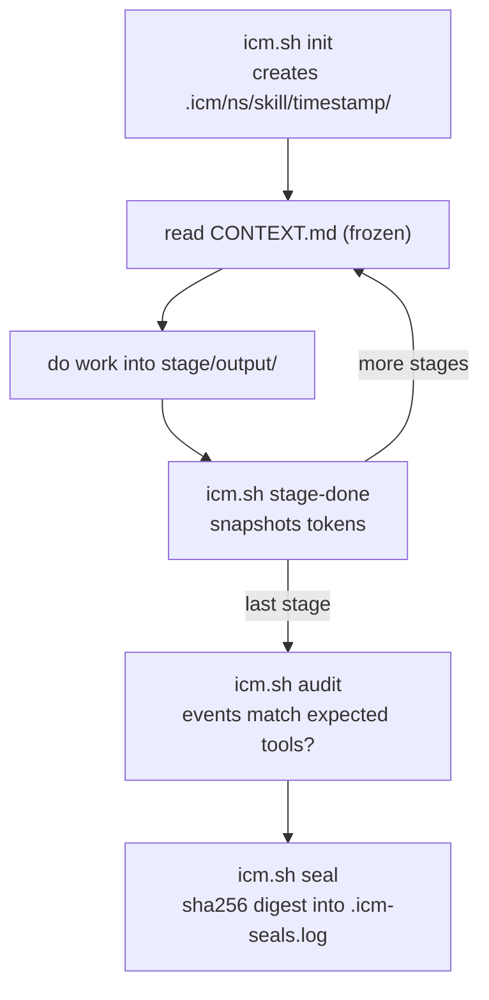

<!--
ICM Runtime - technical deck. Plain markdown; slides separated by `---`.
Mermaid diagrams render in: GitHub preview, HackMD, reveal-md, and VS Code
(with the "Markdown Preview Mermaid Support" extension). Core Marp does NOT
render mermaid.
To present as slides: `npx reveal-md deck.md` (renders mermaid), or paste
into HackMD / a mermaid-aware slide tool.
-->

# ICM Runtime

## Folders as agent architecture

The framework is a folder. The folder proves what it did.

`github.com/KakkoiDev/icm-runtime` - MIT

---

# The problem

Every multi-agent framework orchestrates **in code**.

- CrewAI, LangChain, AutoGen: control flow lives inside Python objects.
- Opaque. Hard to **audit** what ran.
- Hard to **cost** - tokens hide inside the framework.
- Hard to **verify** the agent did what the spec said.

The orchestration is invisible because it is buried in code.

---

# The inversion

Put the orchestration in the **filesystem**, where you can see it.



The runtime owns state. The model is glue between deterministic checkpoints.

---

# Anatomy of a skill

```
kakkoidev/icm-demo/
  SKILL.md            # metadata + how to drive it
  stages/
    01-lifecycle.md   # frozen into the run as CONTEXT.md
    02-enforcement.md
    03-telemetry-seal.md
  checks/*.sh         # gate checkers (frozen, hashed)
  tools/*.sh          # deterministic stage scripts (frozen, hashed)
  eval/*.test.sh      # offline verification
```

Markdown + bash. No framework to learn.

---

# Lifecycle



The model only lives inside the stage loop. Everything around it is deterministic.

---

# Gates: mechanical preconditions

Declared in the stage contract:

```
<!-- ICM-GATE tools="demo_publish" run="checks/ready.sh" -->
```

- `tools=` is a regex matched against the tool name.
- `run=` is a checker; exit 0 = pass. The hook denies on non-zero.
- **Scoped to the active stage only** - fires while its stage is open,
  not before, not after. (Fixed a cross-stage deadlock in v0.6.0.)

Preconditions are enforced, not suggested.

---

# Tamper-evidence: two layers

**Layer 1 - manifest.** sha256 of every frozen `CONTEXT.md`, `checks/`,
`tools/`. Edit a contract mid-run -> gate-check DENIES: "contract tampered".

**Layer 2 - seal.** sha256 of `run.json + events.jsonl + .manifest`, appended
to `.icm-seals.log` (committable, lives at project root).
Edit a sealed file after the fact -> `verify-seal` shows MISMATCH.

You cannot quietly rewrite history of a run.

---

# Token telemetry: four fields

Per stage, read from the session transcript at `stage-done`:

| field | meaning |
|---|---|
| `tokens_in` | new input tokens |
| `cache_creation` | cache write |
| `cache_read` | cache hit |
| `tokens_out` | output |

Read from the transcript, **never hand-passed by the model**.
Reified post-run with exact counts. The model cannot lie about cost.

---

# Cross-harness by normalization

The same gate matches every harness:

```
Claude Code:  mcp__claude_ai_Notion__notion-fetch
pi / Codex:   notion-fetch
```

Runtime strips the `mcp__<server>__` wrapper and folds built-in aliases
(`WebSearch` -> `web_search`). Write `tools="notion-fetch"` once; it matches
both. Enforcement adapters: `gate-hook.sh` (Claude Code), `icm-gate.ts` (pi).

---

# Live demo

`bash .../icm-demo/tools/sandbox-tour`

Offline. Deterministic. ~2 seconds.

DENY -> ALLOW -> normalized DENY -> SEAL OK -> SEAL MISMATCH -> contract tampered

---

# Demo output (backup if no terminal)

```
1 STAGE SCOPING   demo_publish while 01 active -> ALLOW
2 GATE DENY       02 active, ready.md absent   -> DENY (checks/ready.sh)
3 NORMALIZATION   mcp__..__demo_publish        -> DENY (wrapper stripped)
4 NON-GATED       Read                         -> ALLOW
5 GATE ALLOW      ready.md created             -> ALLOW
6 SEAL + VERIFY   seal                         -> SEAL OK
7 SEAL TAMPER     fake event in events.jsonl   -> SEAL MISMATCH (exit 1)
8 MANIFEST TAMPER edit frozen CONTEXT.md       -> DENY contract tampered
```

---

# Where it stands

**Beta.** Architecture is production-grade; process is not yet.

- 111 passing tests, CI on Linux + macOS
- 6 skills shipped (runtime, demo, research, draft-report, publish-to-notion, signoff-proposal)
- Self-contained: bash + jq + sha256sum, no runtime deps
- `icm-demo` doubles as the copyable authoring template
- MIT, honest documented edge cases

---

# What could improve

- **Release process**: no `--version`, no git tags, no release artifacts
- **pi adapter** (`icm-gate.ts`): shipped but untested
- **Skill eval gaps**: `draft-report`, `signoff-proposal` have no `eval/`
- **Docs**: no `CONTRIBUTING.md` / `ARCHITECTURE.md`; `--help` lacks examples
- **Untested edge case**: concurrent sessions in one project

Next step: cut a real tagged 1.0 release.

---

# Appendix

Repo: `github.com/KakkoiDev/icm-runtime`
Paper: ICM, arXiv:2603.16021 (Van Clief & McDermott, 2026)

Install:
```
git clone ... && ./installer.sh
```

Run the showcase, no model:
```
bash ~/.agents/skills/kakkoidev/icm-demo/tools/sandbox-tour
```
