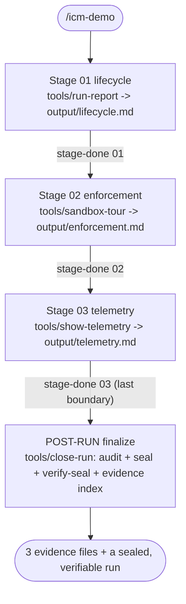

# icm-demo

## Pipeline
Three stages, each capturing real `icm.sh` output through a deterministic `tools/`
script so the evidence is reproducible: stage 01 reports the run lifecycle and the
five tracking artifacts (`tools/run-report`); stage 02 runs the offline
enforcement-and-tamper showcase (`tools/sandbox-tour`); stage 03 shows the per-stage
four-field token telemetry (`tools/show-telemetry`). Sealing is POST-RUN by design - a
stage cannot audit or seal itself, since its own `stage-done` is not recorded until
after its work - so after the last `stage-done`, `tools/close-run` audits, seals,
verifies, and indexes the whole pipeline. Output is three evidence files, a sealed run,
and a finalization shown in chat.



See `references/how-it-works.md` for the tool-to-stage map and the `sandbox-tour` flow.

If you have not run `installer.sh --hooks`, `audit` reports exactly one EXPECTED
deviation ("gates were ADVISORY ONLY") - the runtime honestly reporting that ambient
enforcement is not wired. It is not a failure: enforcement is proven directly in stage
02's sandbox, and the deviation clears once hooks are installed.

## Commands
| Command | What it does |
|---------|-------------|
| `/icm-demo` | Start a new run, all stages |
| `/icm-demo run` | Continue the latest run |
| `/icm-demo run stage <N>` | Re-run a specific stage |
| `/icm-demo list` | Show run history |
| `/icm-demo diff` | Diff the last two completed runs |
| `/icm-demo clean` | Remove old completed runs (keeps latest 5) |

You can also run just the offline showcase, with no model and no run, straight from
the installed skill:
```bash
~/.agents/skills/cyril-antoni/icm-demo/tools/sandbox-tour
```

## What this skill is (and is not)
This demonstrates and teaches the RUNTIME, it does not produce a domain artifact.
Like any ICM skill it creates and seals its own real run under `.icm/`; what is
sandboxed is stage 02's ENFORCEMENT-and-tamper showcase, which runs against a
THROWAWAY copy of this skill in a disposable directory so its deliberate tampering
never touches your real run. It is offline by design: it shows the mechanics that are unique to ICM
(enforcement and tamper-evident telemetry), all of which are checkable with no
external service. It does NOT demo live MCP/web integrations; for that, read a real
integration skill such as `cyril-antoni/publish-to-notion`. See
`references/known-limits.md` for what this demo deliberately cannot show offline.

## How to read this skill as a template
Each ICM authoring construct appears once, in the file you would copy it from:

| Construct | Where to see it | What it does |
|-----------|-----------------|--------------|
| `<!-- ICM-TOOLS expect="..." -->` | every `stages/*.md` | declares expected harness tools (ERE) for `audit` |
| `<!-- ICM-GATE tools="..." run="..." -->` | the `ICM-GATE` line near the top of `stages/02-enforcement.md` | a frozen, harness-enforced precondition gate |
| `<!-- ICM-CALL tool="..." args="..." -->` | `publish-to-notion/stages/03-verify-share.md` | an execution spec `audit` verifies on the call's arguments (needs a real call, so not hosted here - see below) |
| a gate checker (`run="checks/x.sh"`) | `checks/ready.sh` | the deterministic half of a gate; exit 0 = pass |
| deterministic `tools/` scripts | `tools/run-report`, `tools/sandbox-tour`, `tools/show-telemetry`, `tools/close-run` | bash-reachable work frozen into the run and hashed in `.manifest`; one per stage plus the post-run finalizer |
| an eval suite | `eval/*.test.sh` | tests the deterministic surface with no live model |

Why stage 02's gate is safe in a live run: it names a FABRICATED tool
(`demo_publish`) that nothing actually calls, so the gate is inert here and cannot
deadlock the stage's own Bash/Write. The showcase exercises that same frozen gate
explicitly, in the sandbox, by calling `gate-check --tool demo_publish` itself. A
gate on a real authoring tool (`Write`/`Bash`) would block the stage that owns it;
gate real ACTION tools (`notion-create-pages`, ...) instead, on a PRE-action
invariant, as `publish-to-notion` does.

Why there is no `ICM-CALL` in this skill: an execution spec makes `audit` REQUIRE
the named tool was actually called with the given args, so it can only be satisfied
by a real tool call. An offline demo makes none, so a hosted spec would force a
permanent audit deviation. The construct is taught here and shown working in
`publish-to-notion` stage 03. See `references/known-limits.md`.

## Conventions
- Read the full stage contract before executing. Load only what the Inputs table specifies.
- Run every stage's commands from the PROJECT ROOT (where you ran `icm.sh init`); the
  `tools/` scripts read `.icm/` there. Write each stage's output to its EXPLICIT path
  `<run>/<stage>/output/<file>` - the `<run>` path is printed by `icm.sh init`, and
  `init` already created each stage's `output/` dir. Do not assume the current
  directory is the stage dir.
- If `output/` exists from a previous run of this stage, ask: overwrite or skip?
- Execute and close each stage in real time, in order: do the work, then call
  `stage-done`, then move on. Do NOT batch `stage-done` calls or back-fill outputs -
  closing stages in the same instant yields zero-width telemetry windows and null
  per-stage token counts.

## Runtime
This workspace uses the ICM runtime. Do not scaffold directories manually.
- **Never** create state directories, copy files, or format timestamps yourself.
- **Always** delegate filesystem operations to `icm.sh` via the bash tool:
  ```
  bash ~/.agents/skills/icm/runtime/icm.sh <command> cyril-antoni/icm-demo
  ```
- After `icm.sh init`, read the run path from stdout. Check stderr for gitignore warnings and inform the user.
- Each stage's contract is at `<run_path>/<stage>/CONTEXT.md`.
- After each stage, call `icm.sh next cyril-antoni/icm-demo` to find the next empty stage.

## Per-Stage Telemetry (MANDATORY)
After writing output for each stage, immediately call:
```
bash ~/.agents/skills/icm/runtime/icm.sh stage-done cyril-antoni/icm-demo \
  --stage <stage-name>
```
After the full run, call `reify-telemetry` to fill in exact counts:
```
bash ~/.agents/skills/icm/runtime/icm.sh reify-telemetry cyril-antoni/icm-demo
```
The audit command will flag stages that skip the marker.

## Audit
After a run completes, verify all steps were followed:
```
bash ~/.agents/skills/icm/runtime/icm.sh audit cyril-antoni/icm-demo
```

## Seal
Seal AFTER the last stage is closed (a stage cannot seal itself). Stage 03's
`tools/close-run` runs this for you - `audit`, then `seal`, then `verify-seal` - as the
post-run finalizer. The underlying command:
```
bash ~/.agents/skills/icm/runtime/icm.sh seal cyril-antoni/icm-demo
```
Appends digests to `.icm-seals.log` at the project root. Suggest committing it; do not commit it yourself without being asked.
