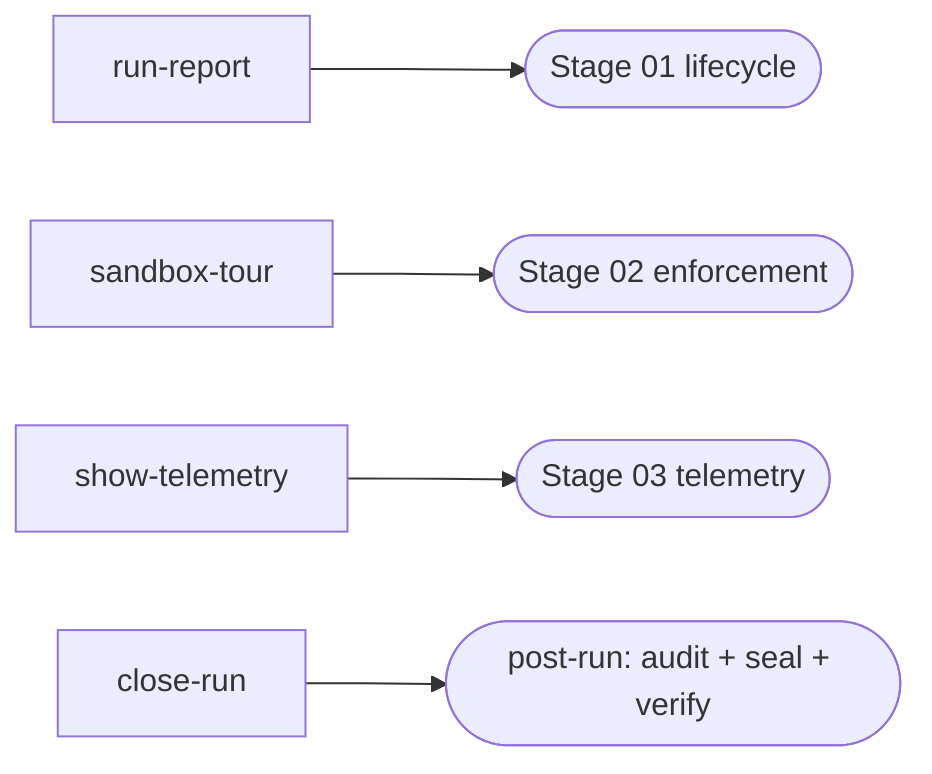
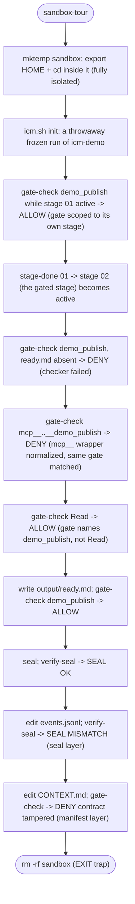

# How icm-demo works

This skill is a runnable showcase of the ICM runtime and a copyable authoring template.
Every stage drives one deterministic `tools/` script that captures real `icm.sh` output
as its evidence; the model only narrates the result in chat. Sealing is post-run.

## The four tools and where they run

| Tool | Runs as | Produces | Touches |
|------|---------|----------|---------|
| `tools/run-report` | Stage 01 body | `output/lifecycle.md` | the real run (read-only) |
| `tools/sandbox-tour` | Stage 02 body | `output/enforcement.md` | a THROWAWAY run in `mktemp` (isolated `HOME`+cwd) |
| `tools/show-telemetry` | Stage 03 body | `output/telemetry.md` | the real run (reify appends `reify` events to `events.jsonl`) |
| `tools/close-run` | POST-RUN finalizer | chat + `.icm-seals.log` | the real run (seals it) |

Only `sandbox-tour` is sandboxed. The other three operate on the demo's own real run,
which is created and (by `close-run`) sealed like any ICM run. Stage 02 is sandboxed
because it deliberately TAMPERS frozen files, which must never hit the real run.

## What sandbox-tour proves (offline, no credentials)

`sandbox-tour` builds a throwaway run of this same skill and drives `icm.sh` through
every offline-checkable mechanic, capturing the real output:

The stage-02 gate names a FABRICATED tool (`demo_publish`) that nothing actually calls,
so it is inert in a live run (it cannot deadlock the stage's own `Bash`); the tour
exercises it explicitly with `gate-check --tool demo_publish`.

## Edge cases specific to this skill

- **Audit shows one expected deviation without hooks.** A live run without
  `installer.sh --hooks` audits with exactly one "gates were ADVISORY ONLY" deviation.
  `close-run` detects and frames it; it is not a failure (enforcement is proven in the
  stage-02 sandbox). With hooks installed: zero deviations.
- **Sandbox token counts are null.** `sandbox-tour` and any no-transcript run show
  `counts: estimated`, `transcript_source: none`. Real four-field counts come from the
  demo's own live run, surfaced by `show-telemetry` and `close-run`'s audit.
- **No `ICM-CALL` here.** An execution spec requires a real tool call, which an offline
  demo never makes; hosting one would force a permanent audit deviation. See the working
  example in `cyril-antoni/publish-to-notion/stages/03-verify-share.md`.

For the runtime-wide edge cases (the two tamper layers, post-run sealing, transcript
resolution, gate scoping, cross-harness naming), see the ICM runtime README's
"Edge cases and gotchas" section, and `references/known-limits.md`.
