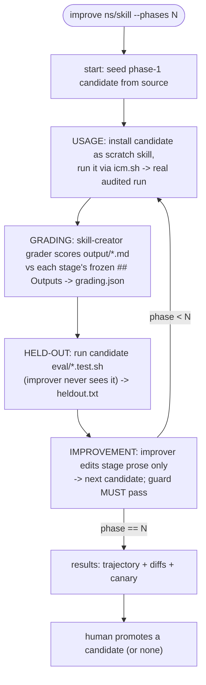

# icm-improve

A self-improvement loop that treats `icm.sh` as an unmodified measurement engine
and the skill source as the artifact under optimization. It is NOT part of the
runtime: you keep running the main tool exactly as before. This skill is only
invoked when you deliberately want to improve a skill's output.

## Three hard rules

1. **`icm.sh` is never modified by this loop.** It runs the candidate, enforces
   gates, writes telemetry and seals. The loop reads its artifacts.
2. **The improver edits stage Process/instruction prose ONLY.** It must never
   change a stage's `## Outputs` section (the rubric), any `ICM-GATE` /
   `ICM-TOOLS` / `ICM-CALL` line, `checks/`, `tools/`, `SKILL.md`, or `eval/`.
   This is enforced by `icm-improve.sh guard`, which MUST pass before a candidate
   advances. If guard fails, the edit is rejected - redo it within bounds.
3. **Promotion to canonical source is human-gated.** The loop produces candidate
   versions and a results report. A human chooses which (if any) to promote.

## Invocation

```
improve <ns>/<skill> [--phases N]    # default N = 3
```

Driver script (deterministic plumbing; never calls a model):
`~/.agents/skills/kakkoidev/icm-improve/scripts/icm-improve.sh`
Runtime engine: `~/.agents/skills/icm/runtime/icm.sh`
Grader (reused as-is): `skill-creator/agents/grader.md`.

## The loop



Per phase `i`:

1. **Usage.** Stage the current candidate as a scratch skill and run it through
   the real engine, so the run is gated, telemetried, and sealed like any ICM run:
   ```
   icm-improve.sh install-candidate <session>/phase-i/candidate <ns>/<skill>__improve
   ```
   Spawn an executor subagent that runs `<ns>/<skill>__improve` end to end via
   `icm.sh init` + stage execution + `stage-done` per stage, then `icm.sh seal`
   (the seal now covers `output/*`, anchoring exactly what gets graded). Record
   the produced run id into `phase-i/run`. Then
   `icm-improve.sh uninstall-candidate <ns>/<skill>__improve`.
2. **Grading.** Spawn the skill-creator grader. For each stage: expectations =
   that stage's frozen `## Outputs` (from the run's `<stage>/CONTEXT.md`);
   `outputs_dir` = the run's `<stage>/output/`. Write the merged
   `grading.json` (with `summary.pass_rate`) to `phase-i/grading.json`.
3. **Held-out.** `icm-improve.sh held-out <session>/phase-i/candidate phase-i`
   runs the candidate's `eval/*.test.sh` - the deterministic canary the grader
   and improver never see.
4. **Improvement.** `icm-improve.sh next-phase <session> i` clones the candidate
   to `phase-(i+1)/candidate`. Spawn an improver subagent given
   `phase-i/grading.json` (failed expectations + evidence) and the candidate's
   stage prose. It edits ONLY Process/instruction prose to address failures.
   Then run `icm-improve.sh guard <session>/phase-i/candidate <session>/phase-(i+1)/candidate`.
   Guard must print `GUARD OK`; if it reports `FORBIDDEN`, the improver overstepped -
   revert that edit and retry within bounds.

Stop after N phases, or early when `pass_rate` plateaus or the held-out count drops.

## Results and promotion

`icm-improve.sh results <session>` writes `results.md`: per-phase `pass_rate`,
held-out status, and the prose diff between consecutive candidates.

**Reward-hacking check:** if `pass_rate` rises while the held-out passed-count
falls, the improver gamed the rubric. Promote only when both move together.

Promotion is manual and outside this loop: a human copies the chosen
`phase-k/candidate/stages/` over the canonical `stages/`, reviews the diff, and
commits. The loop never writes canonical source.

## Disk layout (the audit trail)

```
.icm-improve/<ns>/<skill>/<session>/
  phases                       # target phase count
  phase-1/
    candidate/{stages,checks,tools,SKILL.md,eval}   # phase-1 = copy of source
    run                        # icm run id this phase produced
    grading.json               # grader output (summary.pass_rate, per-expectation)
    heldout.txt                # candidate eval/*.test.sh result
  phase-2/ ...                 # candidate = improver's edit of phase-1
  results.md
```

## Honest limitations

- **Token cost scales with phases:** each phase spawns executor + grader +
  improver subagents. Keep `--phases` small (2-3).
- **Non-deterministic:** the grader is an LLM; `pass_rate` wobbles. Treat the
  held-out eval as the harder line and `pass_rate` as a soft signal.
- **Only as good as `## Outputs`:** vague declared outputs produce vague grading
  and aimless edits. A skill with thin or empty `## Outputs` will not improve
  meaningfully - fix the rubric (by hand, outside this loop) first.
- **Held-out strength depends on the skill's `eval/`:** the canary only catches
  regressions its assertions cover. A skill with weak eval tests has a weak canary.

## Reference

- `scripts/icm-improve.sh` - the deterministic plumbing (start, next-phase,
  guard, install/uninstall-candidate, held-out, results). Env overrides:
  `ICM_SH`, `ICM_SKILLS_DIR`, `ICM_IMPROVE_ROOT`.
- `eval/guard.test.sh` - proves the prose-only guard (rule 2) rejects rubric/
  gate/checks/stage-set edits and allows prose-only edits.
- `eval/smoke.test.sh` - proves session setup and candidate staging.

This skill is an orchestrator, not a staged ICM workspace, so it has no
`stages/` and `icm.sh eval` does not apply to it. Run its tests directly:
`cd <skill-dir> && sh eval/guard.test.sh && sh eval/smoke.test.sh`.
