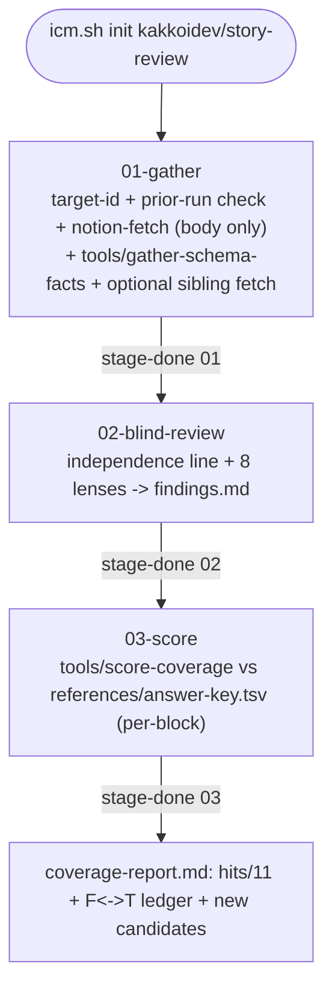

# story-review

## Why this exists

A human review of one user-story doc (Order Management US-01) surfaced 11 distinct
issues across 8 recurring categories - not random nitpicks, but reproducible lenses:
undefined jargon, contradictions between sibling stories, actions that mutate state
with no visible signal, edge-case state transitions nobody enumerated, spec wording
that drifted from the actual codebase, ACs that lean on an unresolved question
elsewhere, "same as X" claims never checked against X, and financial/compliance
fields quietly dropped from a pipeline. `references/answer-key.tsv` freezes those 11
issues as a real, checkable ground truth. This skill applies the 8 lenses to a NEW
target doc; stage 03 mechanically scores stage 02's findings against the frozen key
so `icm-improve` can tune stage 02's prose until the hit-rate matches or beats the
humans - and flags anything stage 02 found that isn't in the key at all (a real "new
or better issue", not just a repeat).

## Determinism boundary (read this)

- **Deterministic** - `tools/gather-schema-facts` (grep, no model judgment): pulls
  the real field/model names for the entities named at invocation out of the
  target repo's schema, so stage 02's ground-truth lens (L5) has something to check
  the doc's claims against besides its own prose.
- **Model-mediated, not scripted** - fetching the target Notion page
  (`mcp__claude_ai_Notion__notion-fetch`) and the review judgment itself. Verified
  via `ICM-TOOLS` and the eval-heldout contract check, not guaranteed by a script.
- **BLIND BY CONSTRUCTION** - stage 01 fetches the page body only. It must never
  call `notion-get-comments` / `include_discussions` and must never be run by an
  agent that has already read this doc's comment thread in the current
  conversation. A "review" informed by the answers already given in comments is a
  lookup, not a review, and will silently inflate the score. If you (the operator)
  have already read this story's comments in this session, invoke this skill from a
  **fresh subagent** that has not - `icm-improve`'s per-phase executor subagent
  already gives you this for free.
- **Fully deterministic** - `tools/score-coverage`: matches stage 02's `findings.md`
  against the frozen `references/answer-key.tsv` PER FINDING BLOCK (never the
  whole file at once - see `tools/score-coverage`'s header comment for why: whole-
  file matching let a primary term in one finding and a secondary term in an
  unrelated finding combine into a false hit neither finding actually supports).
  Reports a hit count plus a full `F<n> <-> T<id>` ledger, both directions - no
  model in the loop, so the number and the evidence behind it are both
  reproducible. This does NOT make the scorer semantically infallible: a finding
  that happens to use both an answer-key row's terms IN THE SAME BLOCK without
  actually being that finding can still register as a false "hit" (observed once,
  see the case study in the case-studies repo) - regex can rule out cross-block
  coincidence, it cannot verify meaning. Spot-check the ledger before trusting
  `Hits: N/M` as a conclusion.
- **Isolation, deterministic** - `tools/check-prior-runs`: before anything else,
  stage 01 writes a bare `target-id.txt`, then this tool greps ONLY other runs'
  `target-id.txt` files (never their findings or story body) to disclose whether
  this target was reviewed before, without ever reading what that run found. A
  hard rule (stated in stages 01 and 02) forbids reading any other run's directory
  for the rest of the run, no exception - this closes a real leak: two runs of
  this skill on the same machine leave their artifacts in the same `.icm/` tree,
  and nothing stopped a later run's agent from noticing and reading an earlier
  run's `findings.md` mid-orientation.

## Pipeline

| Stage | Does | Output |
|-------|------|--------|
| 01-gather | write target-id.txt; check for prior runs on this target (deterministic, metadata-only); fetch the target story body only (no comments); grep the target repo's schema for the named entities; optionally fetch sibling stories for L2 | `target-id.txt`, `prior-runs.tsv`, `story-body.md`, `schema-facts.md`, `epic-siblings.tsv`+`siblings-fetched.md`+`sibling-*.md` (if a parent epic was given) |
| 02-blind-review | disclose independence; apply the 8 lenses to the body + schema facts + siblings, cold | `findings.md` (`Independence:` line, then one `## F<n>` block per finding) |
| 03-score | deterministically match `findings.md` against `references/answer-key.tsv`, per finding block | `coverage-report.md` (hits, matched-with-evidence, missed, new candidates, ambiguous overlap) |



## Invocation

```
icm.sh init kakkoidev/story-review
```
Inputs (from the chat that starts the run): the target Notion page id/URL, the
target repo root path, the space-separated entity names to ground-truth (e.g.
`Estimate EstimateLine BillingInformation Order`), and OPTIONALLY the parent
epic's page id/URL - if given, stage 01 fetches up to 4 sibling stories (by
topic overlap with this doc's ACs) so lens L2 (cross-document contradiction) has
real sibling text to check against, instead of only ever being able to report
"no material."

## Runtime

This workspace uses the ICM runtime. Never scaffold dirs, copy files, or format
timestamps yourself - delegate to `icm.sh` via bash:
```
bash ~/.agents/skills/icm/runtime/icm.sh <command> kakkoidev/story-review
```
After `init`, read the run path from stdout. Each stage's contract is
`<run>/<stage>/CONTEXT.md`. After each stage, `icm.sh next kakkoidev/story-review`
finds the next empty stage.

## Per-stage telemetry (MANDATORY)

After writing a stage's output, immediately:
```
bash ~/.agents/skills/icm/runtime/icm.sh stage-done kakkoidev/story-review --stage <stage-name>
```

## Audit + seal

```
bash ~/.agents/skills/icm/runtime/icm.sh audit kakkoidev/story-review
bash ~/.agents/skills/icm/runtime/icm.sh seal kakkoidev/story-review
```

## Improving this skill

```
improve kakkoidev/story-review --phases 3
```
`icm-improve` edits only stage 02's Process prose across phases, reusing the same
target doc and the same frozen `references/answer-key.tsv`, and tracks
`coverage-report.md`'s hit count phase over phase. A phase that drops the hit
count is a regression, not an improvement - do not promote it. `references/`,
`checks/`, `tools/`, and every stage's `## Outputs` are frozen to the improver (see
`kakkoidev/icm-improve/SKILL.md`), so the answer key itself can never be edited to
make the score look better.

## Reference

- `references/answer-key.tsv` - the frozen, real 11-issue ground truth (id, lens,
  primary/secondary match regex, description) extracted from an actual human
  review of Order Management US-01. Read-only to the improver.
- `tools/gather-schema-facts` - deterministic schema grep (L5 ground truth).
- `tools/score-coverage` - deterministic, per-finding-block findings-vs-answer-key
  scorer with a bidirectional `F<n> <-> T<id>` ledger.
- `tools/check-prior-runs` - deterministic prior-run detector; reads only other
  runs' `target-id.txt`, never their content.
- `checks/gathered.sh` - gate: blocks stage 02's `Write` until stage 01's core
  artifacts exist and are non-empty.
- `eval/structure.test.sh` - skill-shape smoke test.
- `eval-heldout/coverage-contract.test.sh` - proves `coverage-report.md` states a
  well-formed `Hits: N/11` line and all sections (including Ambiguous overlap) on
  the PRODUCED run output.
- `eval-heldout/sibling-coverage.test.sh` - proves every candidate in
  `epic-siblings.tsv` gets a disposition in `siblings-fetched.md` - nothing
  silently dropped from sibling consideration.
- `eval-heldout/independence-line.test.sh` - proves `findings.md` opens with a
  well-formed `Independence:` line, and that it never claims `fresh` when
  `prior-runs.tsv` shows a same-target prior run.
- The actual hit-count trend across runs/phases is the real quality signal - read
  it from `coverage-report.md` directly, or from `icm-improve`'s `results.md` if
  run through that loop.

## Known limitations (not yet fixed - see the case study for detail)

- The per-block scorer eliminates cross-block false positives but cannot catch a
  finding that happens to mention both an answer-key row's terms in one block
  without actually being that finding (same-block topical false positive,
  observed once). Closing this needs genuine semantic verification (an
  adversarial refute-this-finding pass, or a deterministic claim-checker like
  pr-review's `check-value-claims`), not implemented here.
- Validated blind three times now (see `case-studies/story-review-icm-skill.md` in
  the `skillful-ai-engineers-club` repo), all against the one document the answer
  key was extracted from. The 8 lenses are designed to generalize but this has not
  been shown against an independently-answer-keyed second document.
- **Sibling title lookup exposes full sibling bodies to context, not just titles.**
  Notion's `Sub-task` property on the epic gives bare URLs; getting a candidate
  sibling's title (needed to judge topic overlap at all, per stage 01 step 4b)
  requires fetching its full body, even for the ones that won't make the 4-item
  budget cut. Stage 01 now carries an explicit discipline instruction (treat an
  unpersisted sibling as unseen, same as an unread comment) - this is a norm, not
  an enforced guarantee; unlike the comments rule there is no tool-level way to
  prevent the content from reaching context in the first place. Discovered live
  (not hypothesized) during the third validation run - see the case study.
- **`mcp__claude_ai_Notion__notion-fetch` (the OAuth connector) does not attach to
  sessions spawned as separate dispatched processes** (confirmed for
  `tmux-agent-mesh` panes) - `claude mcp list` reports it "Connected" at the CLI
  level, but the process's own tool registry has zero `mcp__claude_ai_Notion__*`
  tools. Root cause: an Anthropic-side, remotely-controlled feature flag
  (`tengu_mcp_subagent_prompt: false` in `~/.claude.json`'s cached GrowthBook
  state, not a local setting) - not fixable locally. Stage 01 now names
  `mcp__notion__API-retrieve-page-markdown` (the official-API integration, static
  key, process-agnostic) as an authorized substitute for exactly this case. That
  path authenticates as a different identity than your personal OAuth login, so it
  needs the target page tree separately shared with the integration in Notion's
  UI - a one-time, per-target-tree, human-only step (no API exists for a bot to
  grant itself page access). Full incident writeup in aidb:
  `FINDING-mcp-claudeai-connector-blocked-for-subagents.md`.
