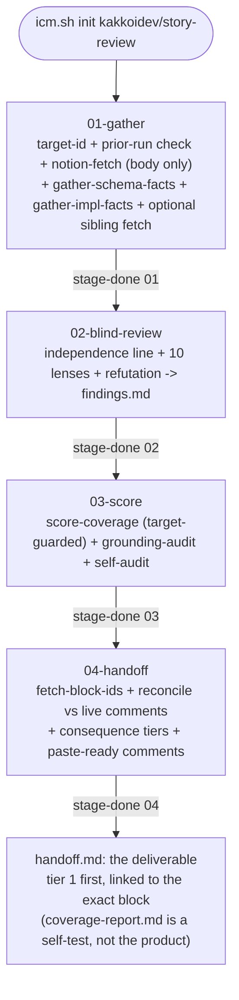

# story-review

## Why this exists

A human review of one user-story doc (Order Management US-01) surfaced 11 distinct
issues across 8 recurring categories - not random nitpicks, but reproducible lenses:
undefined jargon, contradictions between sibling stories, actions that mutate state
with no visible signal, edge-case state transitions nobody enumerated, spec wording
that drifted from the actual codebase, ACs that lean on an unresolved question
elsewhere, "same as X" claims never checked against X, and financial/compliance
fields quietly dropped from a pipeline. `references/answer-key.tsv` freezes those 11
issues as a real, checkable ground truth.

A second real review (a sibling story, plus a fact-check and code-validation pass
over both, 2026-07-29) added two lenses the first set could not see and changed the
skill's shape three ways - each of which had already caused a concrete failure:

- **The answer key is target-bound.** Pointed at a sibling story it scored shared
  financial vocabulary, not coverage. A human had to notice and skip stage 03 by
  hand. Now `tools/score-coverage` refuses to emit a number when the run's target
  isn't the key's source story, and `tools/grounding-audit` supplies a
  target-independent number instead.
- **A schema grep is not implementation ground truth.** Six findings sat at
  "plausible" until someone read real code; one was *partly refuted* by it. A
  `model X { ... }` block cannot show an enum with no `Order` member, a status
  derived in a service file, or what an "existing input" already does.
  `tools/gather-impl-facts` closes exactly those three.
- **The skill produced no deliverable.** Its outputs were raw findings plus a
  self-test of itself. A human hand-built the actual artifact - priority,
  confidence, per-AC location, one product question per row - twice. And on that
  run, the deliverables for three of five stories were written to a scratchpad
  outside the sealed run and were gone by the time anyone looked. Stage 04 makes
  the handoff a sealed stage output.

The refutation pass (25 candidates, 7 killed, 18 survived) is credited with that
review's precision, and it was happening by luck: nothing in stage 02 asked for it.
It is now step 11 and its casualties are recorded.

## Determinism boundary (read this)

- **Deterministic** - `tools/gather-schema-facts` (grep, no model judgment): the
  real field/model names for the entities named at invocation, out of the target
  repo's schema, so stage 02's ground-truth lens (L5) has something to check the
  doc's claims against besides its own prose.
- **Deterministic** - `tools/fetch-block-ids` (Notion REST API walk): every block id
  and anchor URL on the target page, so stage 04 can link a finding to the exact
  acceptance criterion instead of naming it. Complete, unlike the OAuth-connector
  fallback, which only exposes ids for blocks that already carry a discussion. Fails
  loudly rather than emitting a partial list that reads as complete.
- **Deterministic** - `tools/gather-impl-facts` (awk/grep): per name, its own enum
  block, whether it appears as a member of any OTHER enum, and the referencing
  source files with hit counts. The empty results are the load-bearing ones -
  "`OrderLine` is referenced by no source file" and "`CustomFieldTarget` has no
  `Order` member" are only evidence because something explicitly looked. Grounds
  L5's derived-vs-stored and capability-absence checks, and all of L10.
- **Model-mediated, not scripted** - fetching the target Notion page
  (`mcp__claude_ai_Notion__notion-fetch`) and the review judgment itself. Verified
  via `ICM-TOOLS` and the eval-heldout contract checks, not guaranteed by a script.
- **BLIND BY CONSTRUCTION** - stage 01 fetches the page body only. It must never
  call `notion-get-comments` / `include_discussions` and must never be run by an
  agent that has already read this doc's comment thread in the current
  conversation. A "review" informed by the answers already given in comments is a
  lookup, not a review, and will silently inflate the score. If you (the operator)
  have already read this story's comments in this session, invoke this skill from a
  **fresh subagent** that has not - `icm-improve`'s per-phase executor subagent
  already gives you this for free.
- **Fully deterministic, and target-guarded** - `tools/score-coverage`: matches
  stage 02's `findings.md` against the frozen `references/answer-key.tsv` PER
  FINDING BLOCK (never the whole file at once - see the tool's header comment for
  why). Reports a hit count plus a full `F<n> <-> T<id>` ledger, both directions -
  no model in the loop, so the number and the evidence behind it are both
  reproducible. When passed the run's `target-id.txt` and
  `references/answer-key-target.txt` and they disagree, it emits `Hits: n/a` and a
  `## Not applicable` block instead of a number. This does NOT make the scorer
  semantically infallible even on the right target: a finding that happens to use
  both an answer-key row's terms IN THE SAME BLOCK without actually being that
  finding can still register as a false "hit". Spot-check the ledger before
  trusting `Hits: N/M` as a conclusion.
- **Fully deterministic** - `tools/grounding-audit`: counts, per finding, whether
  it carries a story quote, a `Confidence:` label from a closed vocabulary, and an
  `Evidence:` line; and counts refuted candidates separately so
  `Survival rate: S/C` is real. Target-independent, so it is the number that always
  exists. It measures FORM, not truth - a perfectly grounded finding can still be
  wrong.
- **Isolation, deterministic** - `tools/check-prior-runs`: before anything else,
  stage 01 writes a bare `target-id.txt`, then this tool greps ONLY other runs'
  `target-id.txt` files (never their findings or story body) to disclose whether
  this target was reviewed before, without ever reading what that run found. A
  hard rule (stated in stages 01 and 02) forbids reading any other run's directory
  for the rest of the run, no exception - this closes a real leak: two runs of
  this skill on the same machine leave their artifacts in the same `.icm/` tree,
  and nothing stopped a later run's agent from noticing and reading an earlier
  run's `findings.md` mid-orientation.

## Pipeline

| Stage | Does | Output |
|-------|------|--------|
| 01-gather | write target-id.txt; check for prior runs on this target (deterministic, metadata-only); fetch the target story body only (no comments); grep the target repo's schema AND implementation facts for the named entities; optionally fetch sibling stories for L2 | `target-id.txt`, `prior-runs.tsv`, `story-body.md`, `schema-facts.md`, `impl-facts.md`, `epic-siblings.tsv`+`siblings-fetched.md`+`sibling-*.md` (if a parent epic was given) |
| 02-blind-review | disclose independence; apply the 10 lenses to the body + schema/impl facts + siblings, cold; then refute your own candidates | `findings.md` (`Independence:` line, one `## F<n>` block per surviving finding with quote/Confidence/Evidence/Risk, one `## R<n>` block per refuted candidate) |
| 03-score | target-guarded coverage vs `references/answer-key.tsv` (per block), plus the always-applicable grounding + survival audit, plus the mandatory self-audit of any real hits | `coverage-report.md`, `grounding-audit.md`, `self-audit.md` |
| 04-handoff | fetch exact block ids; reconcile every finding against the live comment threads; tier by consequence (tier 1 disaster, capped at 5); write the paste-ready untagged comment and block link for each tier-1 item | `block-ids.tsv`, `handoff.md` |



## Invocation

```
icm.sh init kakkoidev/story-review
```
Inputs (from the chat that starts the run): the target Notion page id/URL, the
target repo root path, the space-separated names to ground-truth, and OPTIONALLY
the parent epic's page id/URL - if given, stage 01 fetches up to 4 sibling stories
(by topic overlap with this doc's ACs) so lens L2 has real sibling text to check
against, instead of only ever being able to report "no material."

**The name list is the input people get wrong.** Give it the domain entities AND
the infrastructure types the doc's claims lean on - not just
`Estimate EstimateLine Order OrderLine` but also the custom-field target enum, the
permission enum, the phase/status type. A narrow list is the known way to get a
thin, falsely-clean `impl-facts.md`: the negative facts that carry the most weight
only appear for names something explicitly looked for.

## Runtime

This workspace uses the ICM runtime. Never scaffold dirs, copy files, or format
timestamps yourself - delegate to `icm.sh` via bash:
```
bash ~/.agents/skills/icm/runtime/icm.sh <command> kakkoidev/story-review
```
After `init`, read the run path from stdout. Each stage's contract is
`<run>/<stage>/CONTEXT.md`. After each stage, `icm.sh next kakkoidev/story-review`
finds the next empty stage.

## Per-stage telemetry (MANDATORY)

After writing a stage's output, immediately:
```
bash ~/.agents/skills/icm/runtime/icm.sh stage-done kakkoidev/story-review --stage <stage-name>
```

## Audit + seal

```
bash ~/.agents/skills/icm/runtime/icm.sh audit kakkoidev/story-review
bash ~/.agents/skills/icm/runtime/icm.sh seal kakkoidev/story-review
```

## Improving this skill

```
improve kakkoidev/story-review --phases 3
```
`icm-improve` edits only stage 02's Process prose across phases, reusing the same
target doc and the same frozen `references/answer-key.tsv`, and tracks
`coverage-report.md`'s hit count phase over phase. A phase that drops the hit
count is a regression, not an improvement - do not promote it. `references/`,
`checks/`, `tools/`, and every stage's `## Outputs` are frozen to the improver (see
`kakkoidev/icm-improve/SKILL.md`), so neither the answer key nor the target it is
bound to can be edited to make the score look better.

**Only run the improve loop against the answer key's own target story**
(`references/answer-key-target.txt`). On any other target the hit count is `n/a` by
design and the loop has no gradient to follow - use `grounding-audit.md`'s numbers
and a human read of `handoff.md` there instead.

## Reference

- `references/answer-key.tsv` - the frozen, real 11-issue ground truth (id, lens,
  primary/secondary match regex, description) extracted from an actual human
  review of Order Management US-01. Read-only to the improver.
- `references/answer-key-target.txt` - the one story that key came from. Frozen.
  What makes the target guard possible.
- `tools/gather-schema-facts` - deterministic schema grep (L5 record shape).
- `tools/gather-impl-facts` - deterministic enum/member/reference grep (L5 derived
  state and capability absence, L10 existing-surface behavior).
- `tools/score-coverage` - deterministic, per-finding-block findings-vs-answer-key
  scorer with a bidirectional `F<n> <-> T<id>` ledger and a target guard.
- `tools/grounding-audit` - deterministic grounding + refutation-survival counter.
- `tools/fetch-block-ids` - deterministic block-id and anchor-URL walk over the
  target page via the Notion REST API, so stage 04 can link a finding to the exact
  acceptance criterion instead of naming it. Takes its token from `NOTION_TOKEN` in
  the environment and never reads secrets off disk. Returns EVERY block, including
  ones with no discussion yet, which the OAuth-connector fallback structurally
  cannot (that path exposes a block id only as a side effect of the block already
  carrying a discussion).
- `tools/check-prior-runs` - deterministic prior-run detector; reads only other
  runs' `target-id.txt`, never their content.
- `checks/gathered.sh` - gate: blocks stage 02's `Write` until stage 01's core
  artifacts (including `impl-facts.md`) exist and are non-empty.
- `checks/reviewed.sh` - gate: blocks stage 04's `Write` until findings exist and
  stage 03's grounding audit actually ran, so the handoff can never be built off
  unaudited findings.
- `eval/structure.test.sh` - skill-shape smoke test.
- `eval/score-coverage-block-split.test.sh` - regression test for the block
  splitter (fails on the pre-fix script).
- `eval/score-coverage-target-guard.test.sh` - regression test for the target
  guard: scores on match, normalizes dashed ids, refuses on mismatch, stays
  back-compatible without id args, hard-errors on one id arg. Verified to fail on
  the pre-guard script with the exact real symptom (a reasonable-looking hit count
  on the wrong story).
- `eval/grounding-audit.test.sh` - unit test proving a refuted block never counts
  as a surviving finding (otherwise killing a weak candidate would raise the
  score) and that every ungrounded finding is named.
- `eval-heldout/coverage-contract.test.sh` - proves `coverage-report.md` states a
  well-formed `Hits: N/11` **or** `Hits: n/a` line with all sections, and that
  `grounding-audit.md` exists and is well-formed, on the PRODUCED run output.
- `eval-heldout/handoff-contract.test.sh` - proves the handoff is tiered with tier 1
  first and capped at 5; that every tier-1 item carries a well-formed markdown block
  anchor (or an explicit `no link available`) and paste-ready comment text; that no
  drafted comment contains a mention; that every `## F<n>` and `## R<n>` is disposed
  of somewhere; and that the grounding number and confidence labels survived. Eight
  negative cases verified, including the bare-URL trap below.
- `eval-heldout/sibling-coverage.test.sh` - proves every candidate in
  `epic-siblings.tsv` gets a disposition in `siblings-fetched.md` - nothing
  silently dropped from sibling consideration.
- `eval-heldout/independence-line.test.sh` - proves `findings.md` opens with a
  well-formed `Independence:` line, and that it never claims `fresh` when
  `prior-runs.tsv` shows a same-target prior run.
- `eval-heldout/self-audit-contract.test.sh` - proves the self-audit covered every
  matched row, and that a `Corrected count: n/a` is only claimed when coverage
  really was `n/a`.

## Fixed 2026-07-30 (from taking a real handoff to the point of sending it)

- **A flat findings list is unsendable, and the skill had no notion of consequence.**
  A 30-item list buried four project-threatening problems among questions that were
  already settled. Stage 04 now tiers by damage: tier 1 is disaster-class (money
  silently wrong at scale, duplicated financial records, a foundational trigger or
  ownership ambiguity forcing rework, an unrecoverable user state) and is **capped at
  5**, because a tier 1 of twelve is the original failure wearing a new label.
  Placing something in tier 1 requires naming the concrete bad outcome AND why
  nothing downstream catches it; "both readings compile and look correct" is the
  strongest signal. Severity does not map to tier.
- **The skill could not tell a new issue from a settled one.** On the reference run
  12 of 30 findings were already answered, three decided the opposite way, and one
  repeated a conflation the PM had corrected that same day. Stage 04 now reconciles
  every finding against the live threads and gives each a verdict
  (UNRAISED / ANSWERED / DECIDED AGAINST / PARTLY ANSWERED), reads the thread's LAST
  comment rather than its first, and records the answered ones so the next run does
  not regenerate them. This reverses an earlier judgment that reconciliation should
  stay a human step: stage 04 must fetch the page's discussion structure to get block
  ids anyway, so not using it would be perverse. It is safe here because stage 02's
  findings are already written and frozen.
- **The deliverable named the acceptance criterion instead of linking it,** so a
  human hunted for each one before commenting. Stage 04 now emits a markdown block
  anchor per tier-1 item via `tools/fetch-block-ids`, plus the comment itself written
  to be pasted verbatim, with no mention in it (the protocol is post untagged, re-read
  to confirm each landed on the right block, then tag per item).
- **Notion silently destroys a bare block URL.** Pasting
  `https://app.notion.com/p/<page>#<block>` as bare text makes Notion convert it to a
  page mention and **strip the `#block` fragment**, leaving a link that opens the page
  and scrolls nowhere. Observed live: all four anchors in a handoff were degraded this
  way and only a fetch-back caught it. Anchors must be markdown links, and the
  held-out contract check rejects a bare URL and a fragment-less link.

## Known limitations (not yet fixed)

- The per-block scorer eliminates cross-block false positives but still cannot
  catch a finding that mentions both an answer-key row's terms in one block
  without actually being that finding (same-block topical false positive).
  Validated across 7 independent runs on 2026-07-28: this inflated the raw
  `Hits: N/M` line by roughly 20-30 percentage points in every single run.
  Closing it for real needs genuine semantic verification (an adversarial
  refute-this-finding pass over the *match*, or a deterministic claim-checker like
  pr-review's `check-value-claims`), not implemented here. **Mitigated, not
  fixed:** stage 03 mandates a manual self-audit pass (`output/self-audit.md`,
  `Corrected count: N/M`) - never trust or report the raw `Hits` line alone.
- `grounding-audit` measures the FORM of evidence, not its truth. `Grounded: 18/18`
  says every finding cited something; it does not say any citation was read
  correctly. It is a floor on discipline, not a quality score.
- **The answer key still covers exactly one story.** The guard stops it being
  misapplied, but it does not create coverage for a second story. Until a second
  document is independently answer-keyed, `Hits` exists for one target and every
  other target is measured by grounding, survival, and human reading only. The 10
  lenses are designed to generalize; two documents' worth of evidence is not proof
  that they do.
- **Repeated independent runs materially improved recall** in the observed data
  (later runs surfaced classes of issue earlier ones missed). That is an operator
  decision - the skill does not orchestrate reruns, and one run is not a thorough
  review of a large story.
- `gather-impl-facts`'s referencing-file list is capped at 20 files per name and
  says so when it truncates. For a generic domain word ("Order") the head of that
  list can be dominated by i18n dictionaries; that is honest noise, not a filtered
  result. Open the files a finding turns on.
- **Sibling title lookup exposes full sibling bodies to context, not just titles.**
  Notion's `Sub-task` property on the epic gives bare URLs; getting a candidate
  sibling's title (needed to judge topic overlap at all, per stage 01 step 4b)
  requires fetching its full body, even for the ones that won't make the 4-item
  budget cut. Stage 01 carries an explicit discipline instruction (treat an
  unpersisted sibling as unseen, same as an unread comment) - this is a norm, not
  an enforced guarantee; unlike the comments rule there is no tool-level way to
  prevent the content from reaching context in the first place.
- **`mcp__claude_ai_Notion__notion-fetch` (the OAuth connector) does not attach to
  sessions spawned as separate dispatched processes** (confirmed for
  `tmux-agent-mesh` panes) - `claude mcp list` reports it "Connected" at the CLI
  level, but the process's own tool registry has zero `mcp__claude_ai_Notion__*`
  tools. Root cause: an Anthropic-side, remotely-controlled feature flag
  (`tengu_mcp_subagent_prompt: false` in `~/.claude.json`'s cached GrowthBook
  state, not a local setting). Stage 01 names
  `mcp__notion__API-retrieve-page-markdown` (the official-API integration, static
  key, process-agnostic) as an authorized substitute for exactly this case. That
  path authenticates as a different identity than your personal OAuth login, so it
  needs the target page tree separately shared with the integration in Notion's
  UI - a one-time, per-target-tree, human-only step (no API exists for a bot to
  grant itself page access). Full incident writeup in aidb:
  `FINDING-mcp-claudeai-connector-blocked-for-subagents.md`.
  Observed again 2026-07-30: an interactive `/login` in the session restored the
  OAuth connector's tools, so re-authenticating is worth trying before falling
  back to the API-key path.

## Fixed 2026-07-29 (from the second real review + code-validation pass)

- **The answer key could be scored against any story.** A sibling story was scored
  against the US-01 key; the number looked reasonable and was meaningless.
  `tools/score-coverage` now takes the run's target id and the key's frozen source
  id and refuses to emit a number when they differ. Regression test:
  `eval/score-coverage-target-guard.test.sh` (verified to fail on the pre-guard
  script, printing exactly the bogus number from the incident).
- **L5 could only see field names.** Added `tools/gather-impl-facts` plus L5's
  derived-vs-stored and capability-absence sub-checks, and L10 for
  "extension of an existing surface" claims.
- **The refutation pass was luck.** Now stage 02 step 11, with killed candidates
  recorded as `## R<n>` blocks and counted into `Survival rate`.
- **Severity was doing confidence's job.** Findings now carry a `Confidence:` label
  from a closed 5-value vocabulary, enforced by `grounding-audit`.
- **The deliverable was hand-built after the run, and sometimes lost.** Added
  stage 04 and `eval-heldout/handoff-contract.test.sh`.

## Fixed 2026-07-28 (during the 7-run variance study)

- **`tools/score-coverage`'s block-splitter used to terminate a finding block
  only at the next `## F<n>` header**, so a reviewer's own non-`F` section
  divider (e.g. a lens note like `## L2 - ...`) glued onto the *preceding*
  block instead of ending it, inflating that block's keyword surface (a stray
  "grounding" note collided with answer-key term "rounding", crediting a hit
  that was really the divider text). Fixed: a block now also ends at any other
  `##`-level header. Regression test:
  `eval/score-coverage-block-split.test.sh` (fails on the pre-fix script,
  passes on the fix - verified both ways).
- **`references/answer-key.tsv`'s T2 regex required the literal phrase "custom
  field"** (with a space), missing real matches phrased "custom-field" or
  "customfield" (no space). Loosened to `custom[- ]?field`.
